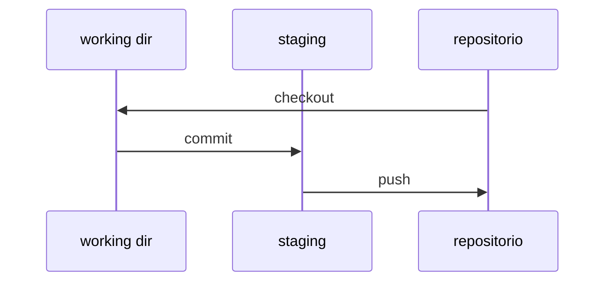

 
# Objetivo
 
# Qué es git?
 
Git es un sistema de control de versiones distribuido. Este, a diferencia por ejemplo, de subversion (svn), no esta centralizado en un servidor. De esta manera, este tipo de repositorios tienen ciertos beneficios notables con los que no cuentan los repositorio del tipo centralizado.

Cada integrante que utilice o participe de un repositorio git, tiene una copia del mismo en su equipo local. Con lo anterior y entre otros beneficios, es lo anterior lo destacable de este tipo de controladores de versiones. Si por ejemplo, el servidor principal donde esta el repositorio se daña perdiendo los datos (o no es accesible) cualquiera de sus usuarios posee una copia original, última/actualizada del mismo.

__Nota inicial:__ para esta introducción se utiliza el CLI bash de Linux y se da por supuesto que se tiene git instalado en el sistema. Los sistemas basado en MacOS y algunas desktop de distribuciones Linux lo traen instalado por defecto.

# Configuración inicial básica (mínima, no obligatoria)
Los siguientes dos comandos no son obligatorios de ejecutarlos (para hacer uso de un repositorio git) pero si por buenas practicas recomendables de hacerlo. De modo que antes de comenzar a usar git, es recomendable ejecutar:

```bash
git config --global user.name "Nombre Apellido"
git config --global user.email "mi.mail@dominio.com"
```

# Inicializando un repositorio (en mi local)

```bash
mkdir mi.repositorio
cd mi.repositorio
git init                # Inicializa el repositorio git (aquí)
echo 'hola mundo!' > README.md
git add -A              # Agrega todos los 
                        #   ficheros del directorio 
                        #   actual (al 'staging area')
git status              # Muestra el estado de los ficheros
# Con commit se agrega el fichero al repositorio. 
git commit -m 'Agrega comentario (sobre el historial)'

```

# Representación de como trabaja git

Los ficheros `trackeados` (que tengan el seguimiento en el repositorio) por git, pueden estar en tres estados diferentes. Estos son



# Trayendo un repositorio

A continuación se muestra una sesión de trabajo, para descargarse y traerse un repositorio desde [Github][github.web]. El nombre del mismo es _Introduction.to.git_ y ya esta creado, e inicialmente no contiene ningún fichero.

- Crear el directorio de trabajo (Directorio de trabajo local. Aqui queda alojado nuestra area de trabajo local, para este repositorio. Es el working dir)

    ```bash
    mkdir introduction.to.git
    cd introduction.to.git
    ```
A continuacion y en orden se realiza:
- Crear el fichero `README.md` con un contenido inicial. _En todo repositorio basado en git, el fichero README.md es el inicial, que se muestra al ingresar al repositorio. Es recomendable que exista._
- Inicializar el repositorio en mi local.
- Definir el branch principal con nombre `main` (Esto no es obligación. Para este branch (el principal) normalmente se utiliza nombre `master` o `main`).
- Agregar el fichero `README.md` al repositorio `git`. (`git add ...`)
- Agregar un comentario, para el historial de los cambios realizados. (`git commit -m "....."`)
- Agregar el repositorio. El mismo (en este caso existente en el sitio de [Github][github.web] debe de estar ya creado) (comando: `git remote add origin git...`. En el actual ejemplo, es mediante `ssh` la conección. También es disponible hacerlo mediante `https`).
- Subir el cambio al repositorio de nuestro fichero `README.md` (comando: `git push -u origin main`)
   ```bash
   echo -e "# Hola\n\nEste es una escueta intro. al uso de git." >> README.md
   git init
   git branch -M main
   git add README.md 
   git commit -m "first commit"
   git remote add origin git@github.com:danielzamo/Introduction.to.git
   git push -u origin main
   ```

[github.web]: https://github.com "Sitio web github"


# Algunas opciones iniciales del comando git

```bash
git config --list # <-- muestra la Configuración del git local

git version       # <-- versión de git instalado

git status        # <-- muestra el estado de los ficheros

# Borrar o dejar de seguir (untraker) un fichero de nombre FICHERO.
#   --cached: no lo borra del directorio de trabajo
git rm --cached FICHERO

git clone NOMBRE_REPOSITORIO # <-- trae a mi 'working dir' un repositorio creado

```

